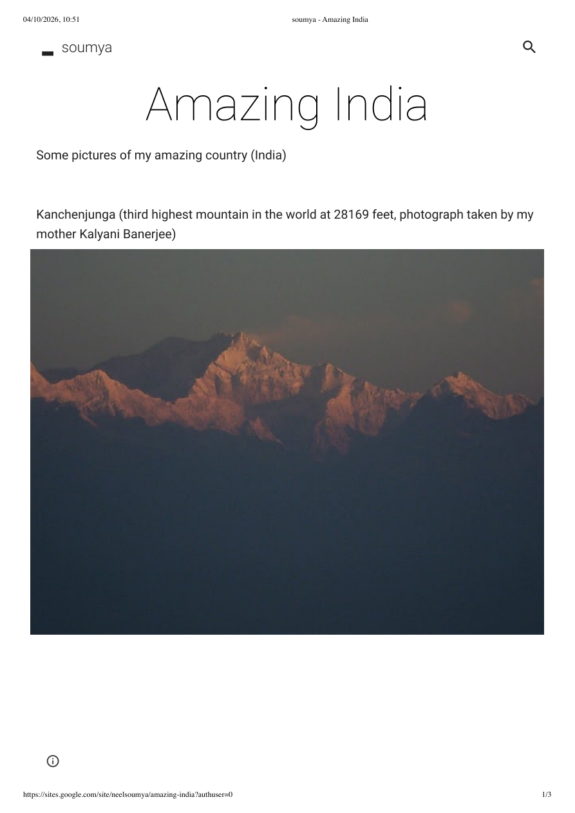
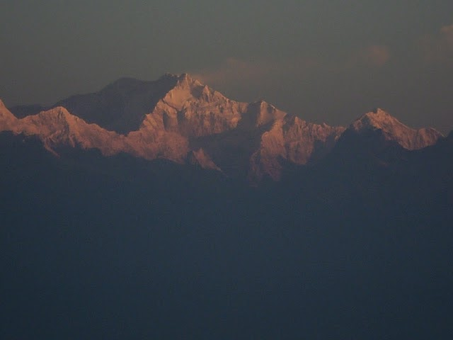
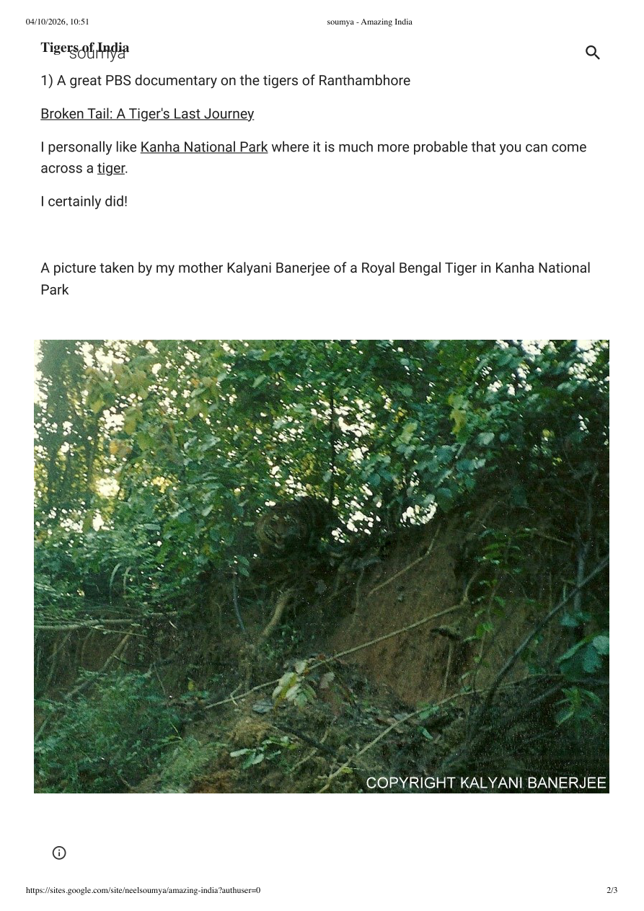
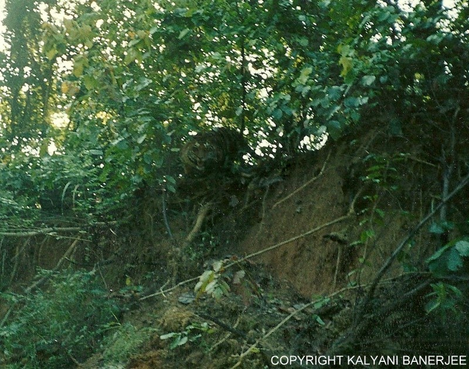

# Amazing India

*Some pictures of my amazing country (India)*

## Kanchenjunga

<!--

-->

**Kanchenjunga** (third highest mountain in the world at 28169 feet, photograph taken by my mother Kalyani Banerjee).

## Tigers of India

1. A great PBS documentary on the tigers of Ranthambhore
   - **Broken Tail: A Tiger's Last Journey**
2. I personally like Kanha National Park where it is much more probable that you can come across a tiger.
3. **I certainly did!**

<!--

-->

A picture taken by my mother Kalyani Banerjee of a Royal Bengal Tiger in Kanha National Park.

## Heritage sites in India

[Heritage sites in India](#)

## Another beautiful picture of two birds

[Another beautiful picture of two birds](#)

## More photographs

You can browse more pictures taken by her [here](#).

## Other links

- **The Story of India by Michale Wood** (a must watch; a beautiful portrayal of India with history interleaved)
- [50 Amazing Photos of India](#)
- [More beautiful photographs of India](#)
- [India travel website](#)
- [A website dedicated to an old friend Tathagata Sengupta](#)

---

