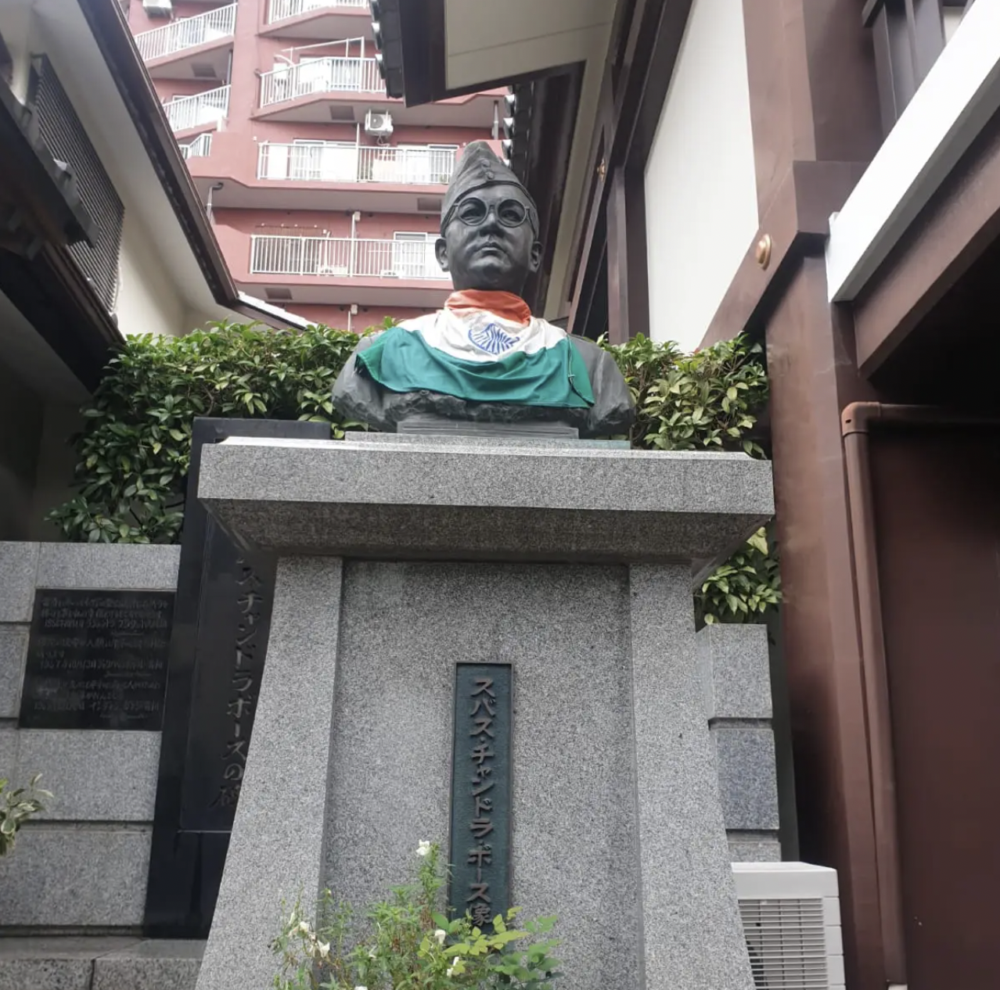
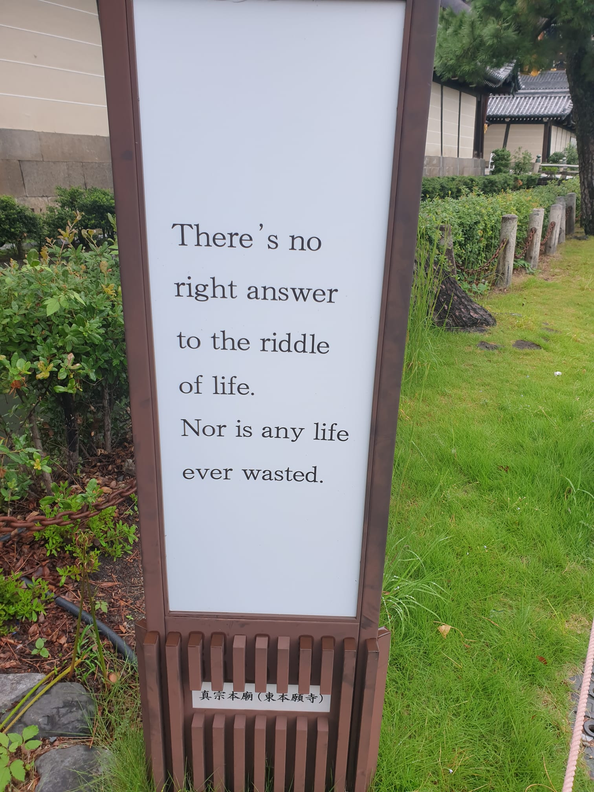

# Japan travelogue

## A monk and a warrior

After months or potentially years of thinking about this, I had finally found the place. I was standing in front of Subhas Chandra Bose’s last resting place (Renkoji temple, Tokyo). 

I sat in front of his statue and his remains, and meditated for a few hours. An old lady and his son came to visit the temple (Renkoji temple, as the name implies also has a Buddhist/Shinto shrine for devotees). I greeted them with the only words in Japanese I knew (konicheewa: hello). I bowed my head and greeted them.

Then I started meditating …..

After a few hours the old lady and her son came out of the temple. She seemed worried about me and said something in Japanese. Unfortunately I could not understand what she said. So again I bowed my head and said konicheewa. My facial expressions must have assured her that I was fine.

I started meditating again  …..  Time went by. It started raining. I took out my umbrella and sat there. My mind started drifting ……

It was a very peaceful place. I was in a suburb of Tokyo. At a nearby park, there was a pond with colourful koi fish in it. People were strolling about and enjoying the peace and quiet.

Little did they know that nestled amongst them rested a true monk and warrior. 

Bose had contemplated life as a monk when he was young. He also could have chosen a life of luxury. He passed the civil service exam in British India and was destined for a life of luxury. 

Instead he chose the hard path.

He chose freedom and liberty from oppression. The path would be hard. He journeyed across the world (that was torn apart by the second world war), sought help from allies and created an army to fight against an oppressive regime.

He left his parents, his wife and his unborn child behind.
So that we could have a bright future.

Now he rests an eternal sleep. He is at peace now in a truly peaceful setting. 

## Kyoto

- I was really tired and I was traveling from Tokyo to Kyoto. As I arrived in Kyoto station on board the bullet train, I was absolutely drenched in sweat. Lugging a heavy suitcase across busy crowded streets on the narrow streets of Kyoto, I was completely drenched in sweat. All of a sudden, I arrived in front of a magical wooden temple with a small moat around it with koi fish in it. In front of it were these Buddhist quotes. I was transfixed and stopped in my tracks to take them in and really assimilate them. It had a very profound effect on me. 

- Taken in front of a temple in Kyoto

