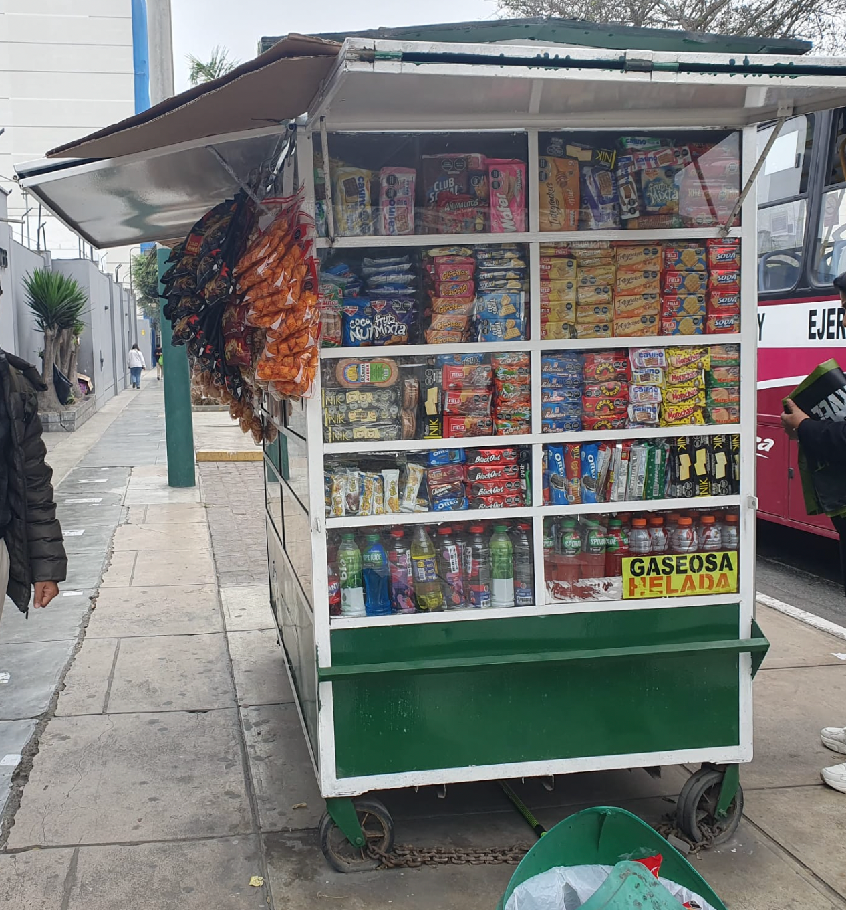
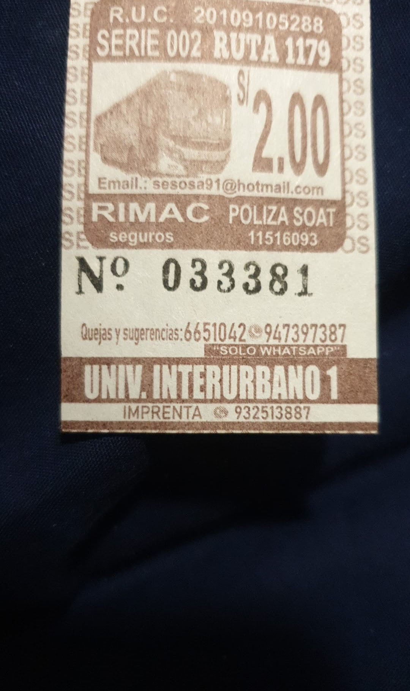
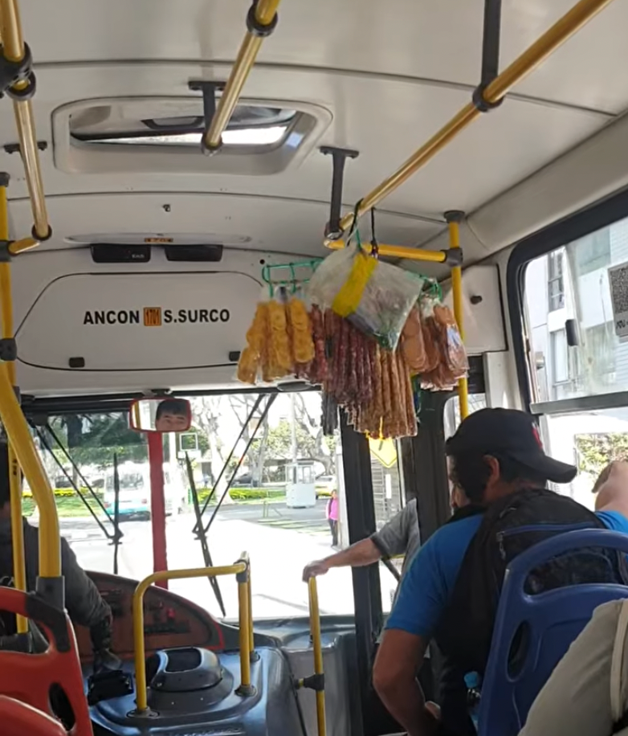

# Peru

We were roaming around the streets of Cusco, Peru. Everywhere we could see small stalls on the streets selling little bits and bobs: toffee, sweets, chewing gum, bottled water, cocoa leaves, etc. These are very colourful shops. Everything was so new.

I was immediately reminded of Kolkata. We also have shops like these informally called "paan" shops (because years back they would sell edible leaves called paan/betel leaf).

I was drawn to the shop. We had some spare change: 0.7 soles. I just showed the shopkeeper how much change I had and gestured to ask what I could buy with that change. She pointed me to 3 sweets and handed them to me. I said "gracias" (thank you) and smiled. She immediately gave me one more sweet and smiled.

Kindness is in all of us.

[*Video: "Beautiful Peru 🇵🇪" — neelsoumya (a trip in Peru is not complete without baby alpacas!)*](https://www.youtube.com/watch?v=YkUK8udCMIc)

## Tickets

One of my memories from childhood is my fascination with buses, trains and trams. Growing up in the city of Kolkata India I was no stranger to trams or streetcars as Americans would call it. Once my school teacher was asking everyone in class what they wanted to be when they grew up. The diligent students would stand up and say engineer or scientist or doctor. I still remember (I must have been nine years old at that time) standing up in front of the whole class and saying I wanted to be a tram driver. Everyone in my class including the teacher started laughing.

The 9 year old me simply could not fathom why I was being laughed at. To my mind the tram driver and the tram conductor were the richest and happiest people in the world. The tram driver would drive at a leisurely pace along the busy streets of Kolkata. The tram conductor had the coveted position of having a heavy leather bag which had a veritable treasure. The treasure were these cardboard tickets that would be handed out to each and every person who boarded the tram.

I still remember getting on the tram and being handed a ticket. I would diligently hold on to the ticket and had a collection of these cardboard tickets at home.

Fast forward many many years I find myself in Lima Peru. Just on a whim instead of taking a cab to the conference, I decided to take a crowded public bus. Imagine my surprise when as soon as I got on the bus I was treated to a ticket (you can see a picture of it above). It immediately reminded me of my childhood. To this day these bus or tram tickets are the best treasures. I still do not understand why I was laughed at in my class.

*Travelling on a bus in Lima, Peru*

One of the most endearing memories of my childhood in Kolkata India was riding on the public buses. Frequently there would be a hawker who would board the bus and start selling some little bits and bobs. There would be assorted things wrapped in plastic: green peas in a hard shell, nuts, sweets. My favourite were these chilli Toffees (which we would call "jhaal lozenge"). One can hardly get them nowadays. But they were a craze in the 1980s and 1990s. There would be an assortment of black or some other dark coloured Toffees which would have chilli in them.

These used to be my favourite. Once you started chewing them it would slowly scrape your tongue which led to a weird sensation. I can feel that sensation now that I am writing this 35 years later.

Sadly with globalisation and modernization those hawkers are seldom seen in Kolkata buses. Gone also are those chilli Toffees.

Imagine my surprise when I recently visited Lima Peru. I could not resist the urge to take a ride on these public buses. They're quite modern; however the drivers speed and the pace at which he drove the buses through the streets of Lima reminded me of the so-called "mini buses" in Kolkata. We hung on to the railings and were treated to a wonderful tour of the city. Each street reminded me of Kolkata.

Once we got on the bus, I realised there was music blaring from somewhere. After a few minutes I turned around and I saw that the music was not coming from the speakers but there was a lady who was actually singing in a very nice voice. After singing for a few minutes she took out a wooden cylinder to ask for money. Sadly I did not have any change to give to her. After doing a few rounds of the bus she got down at the next stop.

After a few stops a new person got on; there was a strange sense of deja vu as soon as I saw this person. The same hawker who has disappeared from Kolkata has now appeared halfway around the world in Lima Peru.

He had with him nuts and various other sweets. Unfortunately he did not have the "jhaal lozenge".

Lima is like a time machine. I have been transported 35 years back to my childhood!

## San Pedro market

One of the earliest memories of my childhood is having street food in Kolkata. I was and still am addicted to phuchka (a savoury dish), egg roll, churmur and the egg chowmein that was served on the streets of Kolkata.

I still miss the street food of Kolkata. My meanderings through the city would be punctured by the sound of a metallic clang of a vendor hitting his hot plate (called a tawa) with a metallic ladle. The sound would alert potential customers to the fact that hot egg chowmein was being served in this street side stall.

I remember before coming back home from my long days in the office, I would inevitably stop by a street vendor who would be selling a savoury spicy dish called phuchka. He knew that I was a special customer: that is I would order at least ten of these delicacies and would have a few freshly cut green chilies on the side. So he would signal with his hands suggesting that I should wait a little bit until he could give me undivided attention. I would accordingly wait for a few minutes until the crowd thinned out and he could give me his undivided attention.

The street side egg roll in Kolkata is another delicacy that I'm very fond of. As a matter of fact, I once met a very nice English lady who said she had been to Kolkata and still missed the egg roll in the city.

Fast forward many years, we found ourselves in Cusco Peru. Somebody had told us about the San Pedro market in the city as a must visit place. Accordingly we went to this place. It immediately reminded me of the old bazaar in South Kolkata (*purono bazaar*) close to where I had grown up.

Stalls overflowed with sweaters made from alpaca wool, other shops were selling local delicacies and chocolates. And to the centre was a massive collection of small stalls, each of which had a few wooden benches in front of them. Each stall was owned by a separate person and advertised in Spanish with some pictures of what food they were offering. I was immediately reminded of the food in Kolkata and the stalls of a bygone era.

I asked myself: Should I go ahead and have the street food? In my mind's eye I could visualise the lovely and well meaning nurse in England who had warned us not to have street food in Peru. Accordingly we had taken lots of vaccines against diptheria, hepatitis, and some other diseases which I cannot even recall the names for!

I mustered up some courage and chose to let it all go. You only live once. Let us go ahead and have the food. However there was still the problem of language to be solved. We sat down and then the shop owner asked us in Spanish what food we wanted. Luckily there was a lady and another gentleman nearby who spoke some English. I roughly communicated to them that I would love to have the chicken. I later learned the Spanish word for chicken is *pollo*.

The shop owner having received our order now started preparing it. I half expected to hear the metallic clang that I used to hear many years back in Kolkata. After a few minutes, we were given a massive portion of rice called *chaufa* and *pollo*. Suffice to say that the food was amazing and the chicken one of the most delicious we have ever had.

In the day and age of modern restaurants, those memories of Kolkata street food have become just a distant dream. It seems the only way to time travel back to those bygone days in Kolkata is to travel to South America.

[*Video: "A walk through San Pedro Market in Cusco Peru 🇵🇪" — neelsoumya*](https://www.youtube.com/watch?v=0gKU-iOSWIE)
