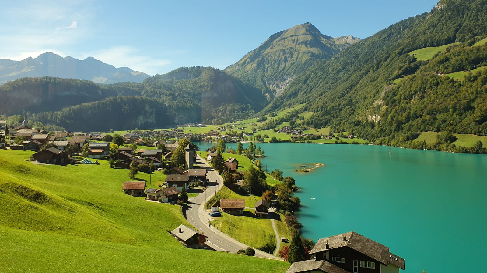

# Travelogue 🇨🇭 Switzerland

- I was traveling in Switzerland for a long time.
- It was very refreshing to see so many Bengali tourists. We met a family from Jadavpur, Kolkata. They were travelling in a group of 21 people for 18 days! It sounded like so much fun to travel in a big group! It reminded me of the time we used to travel in a big group all over India (on trains and buses). The person I spoke with was 71 years old and was excited to see Europe. He said he was going to travel to Germany, Austria and Italy afterwards.
- We also spent time with our Swiss friends and Swiss family.
-  It was really nice to experience authentic Swiss customs and a Swiss wedding.
-  We also had tasty food and great 👍 pastry at _Heini_ Lucerne and _COOP_
- We also had the best Vietnamese food
- We had lots of coffee
- We went to a candlelit dinner in a fancy restaurant (_Thai Garden_) where a woman was playing a traditional instrument
- We also spoke with someone from Nigeria who works in Lucerne. He had good things to say about the Swiss people
- We also liked travelling here. The people are good although reserved
- The food was simply amazing. The broad range of options of pastries, croissant, bread, icecream and chocolates was simply amazing!
- _COOP_ is now my favourite shop! We get variety of breads, croissants, chocolates .....
- The _chocolate factory_ was a great experience. It was a great experience making our own chocolate.
- We saw wonderful mountains, snow capped peaks and [turquoise lakes](https://www.youtube.com/shorts/4OMTkNsFbII)
- I will always remember the Swiss Brienz Rothorn steam train and the snow capped mountains and the [turquoise lake](https://www.youtube.com/shorts/4OMTkNsFbII)
- We had chocolate coins and cuckoo clock
- We had a boat ride (_Brunnen Waldterstadersee_). They were a group of women who were very drunk. One of them said I should have a drink with them and join them next year! I promised I would!
- Travel indeed broadens the mind!

Picture taken by Joyeeta Ghose. This is not AI generated!

